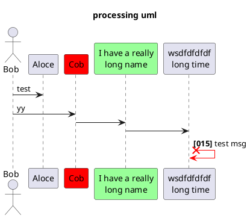

```plantuml
@startuml  

title processing uml 
/'
所有以单引号开头的行 ' 都是注释
你也可以使用多行注释，多行注释以 /' 开头 '/ 结尾。
'/

'我是单行注释

participant Cob #red

actor Bob
Bob->Aloce:test
database Cob
Bob ->Cob:yy
participant "I have a really\nlong name" as L #99FF99
Cob-> L


L -> "wsdfdfdfdf\n long time" as W
autonumber 15 "<b>[000]"
W x-[#red]>W:test msg

@enduml  
```

